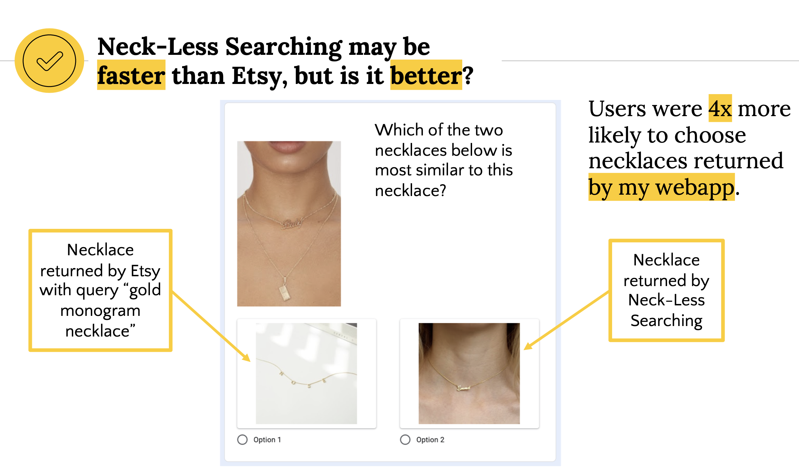
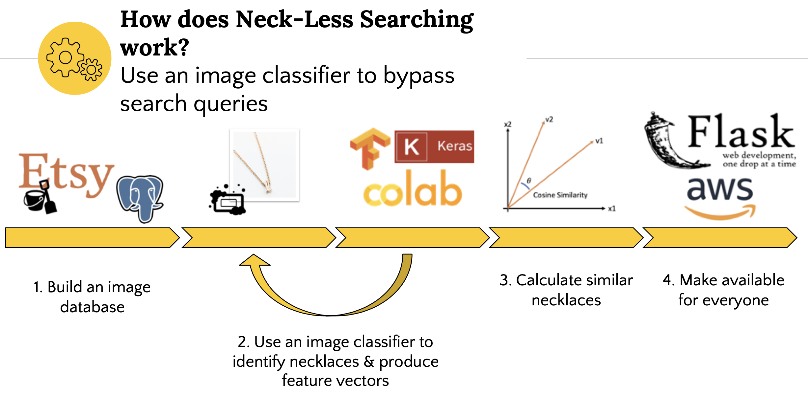
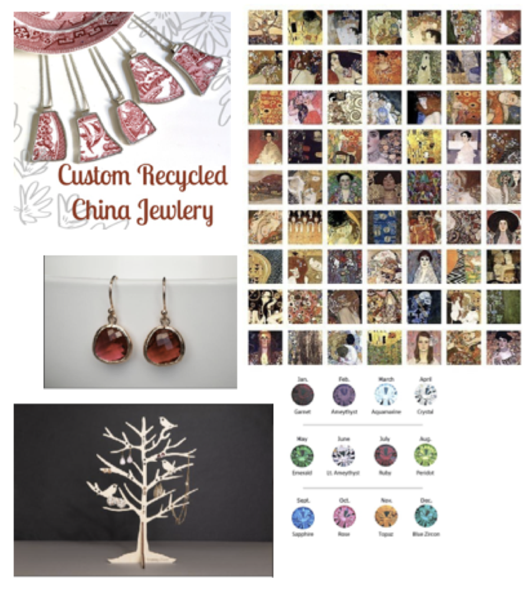
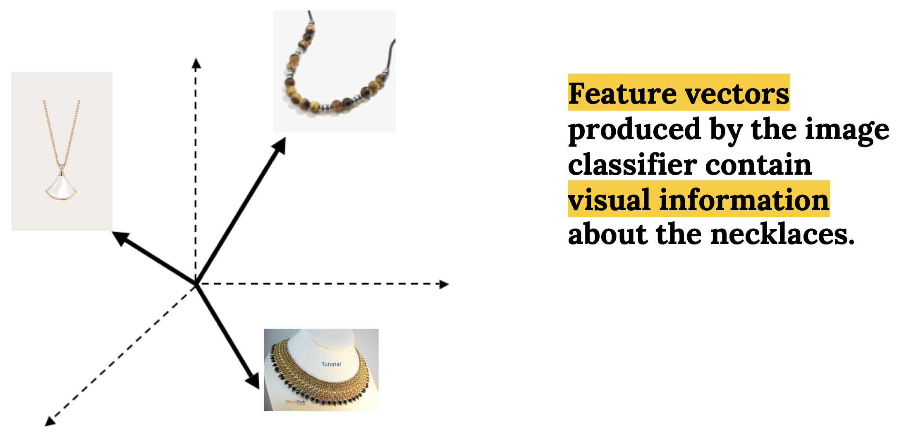

# Neck-Less Searching
### *A webapp built to connect you instantly to the Etsy necklace you're looking for*
#### Written by Eleanor Middlemas, 2020

Webapp may be found at [neck-less-searching.xyz](neck-less-searching.xyz).

This webapp was motivated by my own experience spending countless hours on Etsy looking for specific items I have in mind. Instead of building a webapp for all items on Etsy, I chose necklaces because  (1) Necklaces are special because typically people are looking for a specific style, and  (2) I'm not sure I could build a webapp within 3 weeks that would return better results on Etsy than their built-in recommender for all items.  By focusing on necklaces, this app actually works *with* the recommender system on Etsy to cut down on search time and help users find that necklace they're looking for in a matter of a few clicks.
  

### Human Validation
If you had a chance to play with the app, you will have noticed that the webapp *should* return results within a matter of seconds. That's clearly less time than perhaps the hours you may spend searching on Etsy, getting lost in thinking of the appropriate search terms.   
__But does my web app do *better* than Etsy in terms of finding similar necklaces?__  
To test this, I created a Google survey filled with images. Each question was the same: between the two images below, which one is most similar to the prompted image? I prompted users with 25 randomly-chosen necklace images. For each image, I provided (1) the first image returned by a typical word search query related to the image prompt, and (2) the first image returned by my web app.  

  
Around 50 users filled out the survey. I found that users were __*four times*__ more likely to choose the necklace returned by my web app as the "most similar" necklace.  

# Data analysis pipeline

 *Image taken from slides. In fact, the information below is another description of the information found in my demo slides.*  

## 1. Build an image database
*Code found in ./necklace_finder/scrape_etsy/*  
First, I had to build a database of Etsy Necklaces listings and associated images. This required that I scrape Etsy. Luckily, Etsy has a user-friendly Python module API, allowing one to easily connect to their API in python with a simple user key.   
I had to scrape each listing twice: first to scrape the listing ID, any tags, or other user descriptions that may help me label the data later, and then I scraped again with the listing ID to scrape the listing images. I ended up scraping around 20,000 images & associated listings. I then saved the text data, links to Etsy listings, and filepaths to the associated images in a PostgresQL database.  
After scraping the data, I performed some initial EDA - namely, plotting the distribution of certain tags and checking to see if tags matched with the images (*found in ./necklace_finder/simple_eda/visualizaing_thedata.ipynb*). Well... surprise, surprise - the tags and other descriptions I scraped ended up being pretty useless. Tags & descriptions were user-defined, subjective, and often incorrect or inaccurate. Numerous listing photos weren't even necklaces. 
 
*Examples of Etsy images scraped with the tag "Necklace"*
  

## 2. Use an image classifier to identify necklaces & produce feature vectors
Most of the labels provided by Etsy ended up being useful. So, not only did I need a way to label the images, I also had to figure out a way to determine image similarity in order to return the most similar necklaces to users.   
I decided that its most important to determine whether or not there is a necklace in the image, which means I needed to use a binary classifier to sort the images and separate necklaces from non-necklaces. I decided to use a __semi-supervised__ learning technique to label and then train a binary image classifier to identify whether there was indeed a necklace in the image.  
First, I would hand-label a small subset of images based on whether or not a necklace existed in the image (*found in ./necklace_finder/model_testing/semi_supervised_labeling/sortnecklaces_binary.py*)  
Then, I added four more layers to a pre-trained VGG16 Convolutional Neural Network model to train to specifically recognize necklaces from non-necklaces. Then, I used that trained model to label more images. I checked the model's answers, and corrected the labels if needed. This was a very tedious process, but eventually the model seemed to converge at an accuracy of around 85% (*VGG16 code found in ./necklace_finder/model_testing/binary_VGG.ipynb - best run on Google Colab. Semi-supervised learning code found in ./necklace_finder/model_testing/semi_supervised_labeling/*).  

## 3. Calculate similar necklaces
After I attained metrics that seemed reasonable in the CNN, I extracted the *feature vectors* from the layer prior to the classification layer. I stored these feature vectors with each listing in the PostgreSQL database. These feature vectors, composed of 2048 values, gave me a way to extract feature similarity. For the app, I ended up using Cosine Similarity to measure image similarity. 

  

## 4. Make available for everyone
By building a Flask webapp and hosting on AWS.  *Code found in ./necklace_app/*  
I uploaded my PostgreSQL database and associated necklace images on AWS, along with a python script to analyze new input images.  
The web app works by: 
1. Requesting users to upload an image of a necklace
2. Running that necklace through the binary classifier to determine if a necklace is detectable in the photo. If not, an error message is returned that warns the user that no necklace is detected.
3. If a necklace is detected, the feature vector is extracted using the binary classifier.
4. The similarity is calculated between new uploaded image's feature vector and all feature vectors in the PostgreSQL database. 
5. The top four similar images are located, and the webapp returns these images along with links to associated Etsy listings.
 

## Detours and extra code
This project required that I meet a few dead ends and pivot a few times before arriving at the best method. I am listing the available code that led to the pivots for reference.
1. __I tried different models.__ I ultimately chose the VGG16 model because, frankly, I was exposed to VGG16 model after, say, the ResNet model. If I had more time, I'd try this again with the ResNet model. I just didn't have enough time re-write and re-tune for the ResNet model. I also didn't use the VGG19 model because it took longer to train and the metrics weren't much better. The code to those may be found in *./necklace_finder/model_testing/other_models/* as well as *./necklace_finder/model_testing/tuning_binary_model/binary_VGG19.ipynb*
  
2. __I started by trying to categorize necklaces into different types (beaded, chain, pendant, etc).__ This ended up being extremely difficult because I had to hand-label much more data prior to training the model. I found that, despite which type of model (categorical or binary), the necklaces returned by similar feature vectors were subjectively similar. Since binary classification was much easier - I abandoned trying to build a categorical classifier. *Code may be found ./necklace_finder/model_testing/categorical_VGG16.ipynb and ./necklace_finder/model_testing/semisupervised_labeling/*
  
3. __I initially calculated similarity using a method called LSHash.__ This method uses hashing to first organize feature vector similarities, and then uses something like Cosine Similarity within each hash to detect the most similar vectors. I found that LSHash was __much__ slower than simply using cosine similarity across my database of image feature vectors. For much larger databases, LSHash may be faster. *Code may be found in ./necklace_finder/model_testing/semisupervised_labeling/lshash_2/* 
